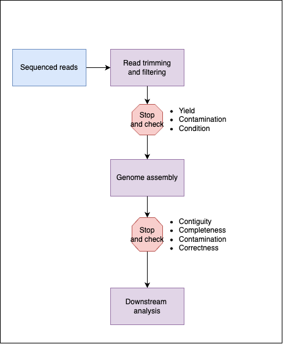

When receiving results from bacterial genomics analyses such as genotyping, *in silico* serotyping, clustering, phylogenetic inference, and predicting antimicrobial resistance (AMR) determinants, you should remember that your data has traversed a laborious and exhaustive journey. That journey could look something like this:


Each of these steps have the potential to introduce errors. Errors which could drastically alter the final interpretation. As a Bioinformatician looking at the data post sequencing, there are two easy oppotunities to assess the quality of the data as it makes it way through our workflow. We should:

* Check the seqeunced reads directly (i.e. the FASTQ output from the sequencing instrument) after simple filtering processes like removing known adapters, 
* AND Check the quality of the resulting genome after being assembled from the sequenced reads. 



Many bioinformaticians have their own preferred approach for checking data quality. If you ask them for their approach, they will usually list a set of programs without much explanation as to how these tools were selected and what issue they are trying to address. Here is a well described genome assembly pipeline that covers both read quality control and genome assembly quality control. 


The pipeline (and figure) are from the [GHRU SPAdes Assembly workflow](https://gitlab.com/cgps/ghru/pipelines/dsl2/pipelines/assembly). In my opinion, this is a comprehesive pipeline that produces good results. You are welcome to use it. Hopefully you can see that in these steps, while cleared named, it is not obvious why these steps are necessary. 

When working with genomic data, all quality control tools answer one or more of these broad questions: 

* Do I have enough sequenced reads for my work?
* Are the sequenced reads from the organism I am expecting? 
* Does the quality, provided by the instrument, meet my expectations?
* Does the genome assembly look like an intact genome from the organism I am expecting?

These four questions can be broken down into seven criteria (with a extra bonus criterion) for quality control of genomic data. Some of these relate to the seqeuenced reads while others apply to the genome assembly. 

* Sequence reads - Yield
* Sequence reads - Contamination
* Sequence reads - Condition
* Genome assembly - Contiguity
* Genome assembly - Completeness
* Genome assembly - Contamination
* Genome assembly - Correctness
* Genome assembly - BONUS: Circumstantial

When working with genomic data, try not to get overwhelmed with the myriad of tools that assess these categories in one way or another. Instead, keep this list in mind and pick an approach that assesses each criterion. The exact specifics of which tools and what thresholds and metrics you employ is dependant on your specific question. We will go over some of the regularly used tools for typical usage. 

## Yield (Sequence reads)
*Do I have enough sequenced reads for my work?*. We assume that in whole genome sequencing that the selection of DNA is random, such that with enough sequencing we should see representation of every position in the genome. In order to have confidence of the base called in that position, we *over*sample to have a number of reads from the same position to form a consensus. There are two main reasons why we oversample:

* The selection of DNA is *not* actually random. Some regions of the genome can prove problematic for some sequencing technologies, or some regions tend to be favoured by some technologies. If you plot the true read coverage across a genome, you will often see coverage variation across the genome - and in some region the coverage can be too low. For this reason, oversampling allows us to overcome any regions that may potentially drop out. 
* Sequencing technologies can not perfectly read individual bases. For a number of reasons which depend on the specific instrument, there will be erroneous bases introduced in individual reads. Luckily, for most instances, the error is random so by having additional reads of the same location we can correct errors in individual reads by looking for a consensus base call. 

Assuming that the DNA selection is random (which it isn't), we can do a quick calculation of the average coverage across a genome. We need to know the length of the original genome (G), the number of reads (N), and the average read length (L) to calculate the coverage which is: 

```
N x L / G 
```

Basically, the total number of bases divided by the length of the genome.

!!! Exercise
    Try this yourself, for a bacterial genome of 5 megabase pairs (5,000,000 bp) and an average read length of 150 bases. How many reads do you need to have 30 times coverage?

There are more comprehensive ways to calculate genome coverage, but this is an easy place to start. The answer, by the way, is one million reads. 

!!! Exercise
    If our sequencing platform has 20 gigabase pairs (20,000,000,000 bp) yield per sequencing run, how many isolates could we sequence; given the values in the exercise above? 

The answer is 133 isolates. So what yield should you aim for? The answer is what you hate to hear - it depends. It depends on your organism, and on your use case. As long as you do not hold me accountable I will tell you that in my work, I have gone as low as FIVE times coverage for analyses with read mapping, which is where individual reads are aligned to a reference; and as low as TWENTY times coverage to produce reasonable genome assemblies. However, for genome assemblies and most use cases I have encountered I would recommend genome coverage between 40 to 100. 

### Contamination (Sequence reads)

*Are the sequenced reads from the organism I am expecting?*. We usually have an idea of what organism has been sequenced in each sample, we may know this in terms of the species, or we may have more refined information in terms of the seqeunce type, serotype, lineage or clade. This information is often from other molecular tests, or from the culturing protocol (e.g. selective media). We thus assume that the vast majority of sequenced reads of the sample should be consistent with this prior information. 