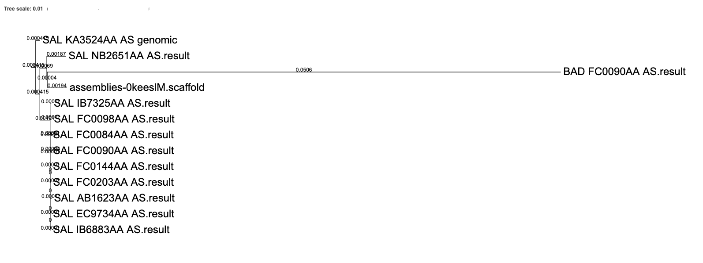

It is!

## A *Salmonella* example of poor data

In this example, I selected 12 *Salmonella enterica* ser. Cholerasuis and created "a poorly assembled" genome from one of them (SAL_FC0090AA_AS). I then created a neighbour joining tree based on average nucleotide idenitity using [mashtree](https://github.com/lskatz/mashtree) to show you the effect. This is a common tool for creating a tree to show the similarity between genomes. `BAD_FC0090AA_AS.result.fasta` is a clear outlier, and no where near `FC0090AA_AS.result.fasta` which it was based on. If this analysis method was capable of handling the poorly assembled genome we should see the two genome together. This amount of difference between `BAD_FC0090AA_AS.result.fasta` and the others, is enough to change our intepretation. For instance, if the other genomes belonged to an outbreak, would we consider `BAD_FC0090AA_AS.result.fasta` part of that outbreak too?  

