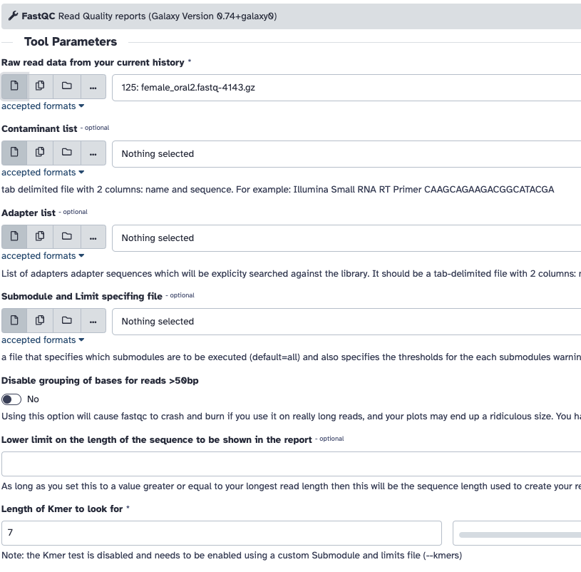
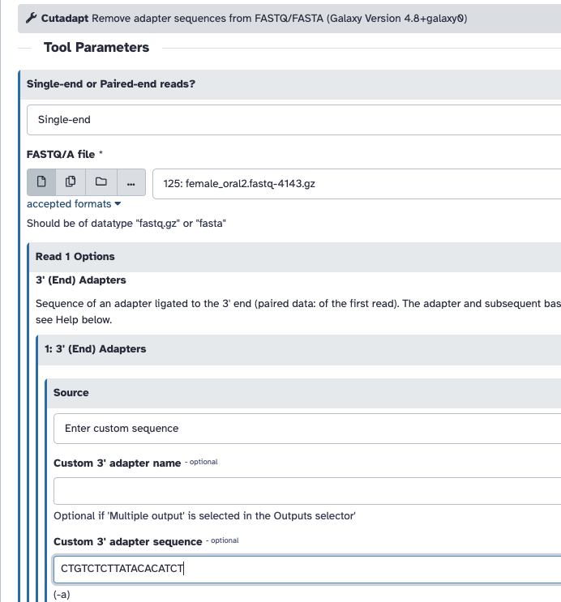
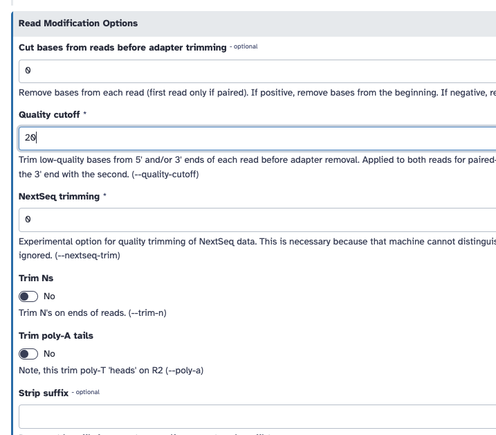

In this section, we will be using some example data to assess the quality of short reads. We will use the tool, FASTQC. We will also use some tools to trim poor quality reads (or parts of reads).

**You can also run [Kraken2 to detect contamination](/quality-control/10-read-classification)**

### Where is the example data? 

* [https://zenodo.org/record/3977236/files/female_oral2.fastq-4143.gz?download=1](https://zenodo.org/record/3977236/files/female_oral2.fastq-4143.gz?download=1)
* [https://zenodo.org/records/10018484/files/pKP1-NDM-1_R1.fastq.gz?download=1](https://zenodo.org/records/10018484/files/pKP1-NDM-1_R1.fastq.gz?download=1)
* [https://zenodo.org/records/10018484/files/pKP1-NDM-1_R2.fastq.gz?download=1](https://zenodo.org/records/10018484/files/pKP1-NDM-1_R2.fastq.gz?download=1)

**female_oral2.fastq.gz**: This is a microbiome sample (16S) from a snake [Jacques et al. 2021](https://qubeshub.org/community/groups/coursesource/publications?id=2727&v=1).


!!! note
    Remember, the pKP1-NDM-1 reads are simulated reads, with minimal error. These are effectively "perfect" and will not be representative of real data. We can use this to compare with problematic data (female_oral2.fastq.gz)


### Required software

If you want to run this on the command-line, you may need to install some software. 

* [FASTQC](https://www.bioinformatics.babraham.ac.uk/projects/fastqc/)
* [Cutadapt](https://cutadapt.readthedocs.io/en/stable/)

This is how to do it via conda: 

```
conda install fastqe fastqc cutadapt -y
```

Downloading the reads via the command line 
```
wget -O female_oral2.fastq.gz https://zenodo.org/record/3977236/files/female_oral2.fastq-4143.gz?download=1
wget -O pKP1-NDM-1_R1.fastq.gz https://zenodo.org/records/10018484/files/pKP1-NDM-1_R1.fastq.gz?download=1
wget -O pKP1-NDM-1_R2.fastq.gz https://zenodo.org/records/10018484/files/pKP1-NDM-1_R2.fastq.gz?download=1
```

## Assess quality with FASTQC

One way we can check sequence quality is with [FastQC](https://www.bioinformatics.babraham.ac.uk/projects/fastqc/). It provides a modular set of analyses which you can use to check whether your data has any problems of which you should be aware before doing any further analysis. We can use it, for example, to assess whether there are known adapters present in the data. We'll run it on the FASTQ files.

### FASTQC in Galaxy



* Go to the Galaxy server's website. If you're using a public Galaxy server, you can usually access it through a web browser without needing to install anything locally.
* Before running FASTQC, you'll typically need to upload your data files to Galaxy. You can do this by clicking on the "Upload Data" button or using the "Get Data" menu to import data from various sources.
* Once your data is uploaded, find the FASTQC tool. Tools are organized into categories, and you can search for specific tools using the search bar.
* Click on the tool's name to open it. You'll see a form where you can configure the tool's inputs and parameters. Fill in the required fields and adjust any optional parameters as needed.
* After configuring the inputs, scroll down to the bottom of the form and click the "Execute" or "Run" button to start the tool.
* Galaxy will start running the tool, and you'll be redirected to the "History" panel where you can monitor the progress of your job. Depending on the tool and the size of your data, it may take some time to complete.
* Once the job is finished, you can view the results by clicking on the dataset in the history panel. You can download the results, visualize them, or use them as inputs for further analysis.

### FASTQC on the command line
To run FastQC, open your terminal or command prompt and navigate to the directory where your data files are located. Then, use the fastqc command followed by the path to your data files. For example:

```bash
fastqc file1.fastq file2.fastq
```

You can also use wildcards to analyze multiple files at once, like this:
```bash
fastqc *.fastq
```

FastQC will process each file and generate an HTML report for each. *Are you able to open the report via the notebook file browser?*.  The reports contain various quality control metrics and visualizations. See the help via:

```bash
fastqc --help 
```

!!! tip
    FASTQC will also work for long reads. 

### Exercise 1: Run FASTQC

* Run FASTQC on female_oral2.fastq.gz.
* Run FASTQC on pKP1-NDM-1_R1.fastq.gz and pKP1-NDM-1_R2.fastq.gz together.
* Review and compare the HTML reports.

If you are unable to run FASTQC, here are some precalculated results; [female_oral2](/quality-control/files/FastQC_oral.zip), [pKP1-NDM-1](/quality-control/files/FastQC_pndm1.zip). 

**Which metrics are a major difference between the two reports?**

**What is the parts of the report are missing for pKP1-NDM? Can you explain why?**

**Review each metric for female_oral2.fastq.gz, what part of each plot suggests there is a problem?**

!!! tip
    Remember, the pKP1-NDM-1 reads are simulated reads, with minimal error. These are effectively "perfect" and will not be representative of real data. We can use this to compare with problematic data (female_oral2.fastq.gz)

**female_oral2.fastq.gz data looks terrible, we should probably resequence it, but if we had to; how could we improve the quality?**

[Answers to exercise 1](/exercise-answers/short-read-qc-answers)

## Trim and filter - short reads

The quality drops in the middle of these sequences. This could cause bias in downstream analyses with these potentially incorrectly called nucleotides. Sequences must be treated to reduce bias in downstream analysis. Trimming can help to increase the number of reads the aligner or assembler are able to succesfully use, reducing the number of reads that are unmapped or unassembled. In general, quality treatments include:

* Trimming/cutting/masking sequences
    * from low quality score regions
    * beginning/end of sequence
    * removing adapters
* Filtering of sequences
    * with low mean quality score
    * too short
    * with too many ambiguous (N) bases

To accomplish this task we will use [Cutadapt](https://journal.embnet.org/index.php/embnetjournal/article/view/200), a tool that enhances sequence quality by automating adapter trimming as well as quality control. We will:

* Trim low-quality bases from the ends. Quality trimming is done before any adapter trimming. We will set the quality threshold as 20, a commonly used threshold.
* Trim adapter with Cutadapt. For that we need to supply the sequence of the adapter. In this sample, Nextera is the adapter that was detected. We can find the sequence of the Nextera adapter on the Illumina website here `CTGTCTCTTATACACATCT`. We will trim that sequence from the 3’ end of the reads.
* Filter out sequences with length < 20 after trimming

You can do this on galaxy: 






If you are unable to run this, here is the FASTQC output [pre trimming](files/FastQC_pre-trimmed.zip) and [post trimming](files/FastQC_post-trimmed.zip) to compare. 

### Exercise 2: Trim and filter

**Use cutadapt to trim the adapter sequence from the 3' end of the reads, and filter out sequences with a length less than 20 after trimming.**

**Run FASTQC on the trimmed data and compare to the original file.**

**Does the per base sequence quality look better?**

**Is the adapter gone?**

**What can you say about some of the other metrics?**

**If you are attempting this on the command-line, you can run cutadapt like:**

```
cutadapt -q 20 -a CTGTCTCTTATACACATCT -m 20 female_oral2.fastq.gz  | gzip -c > female_oral2.trimmed.fastq.gz
```

Can you explain what each of the options does?


[Answers to exercise 3](/exercise-answers/short-read-qc-answers2)

## Acknowledgements

Some of this material was adapted from:

* Bérénice Batut, Maria Doyle, Alexandre Cormier, Anthony Bretaudeau, Laura Leroi, Erwan Corre, Stéphanie Robin, Erasmus+ Programme, Cameron Hyde, Quality Control (Galaxy Training Materials). https://training.galaxyproject.org/training-material/topics/sequence-analysis/tutorials/quality-control/tutorial.html Online; accessed Wed Oct 18 2023
* Hiltemann, Saskia, Rasche, Helena et al., 2023 Galaxy Training: A Powerful Framework for Teaching! PLOS Computational Biology 10.1371/journal.pcbi.1010752

